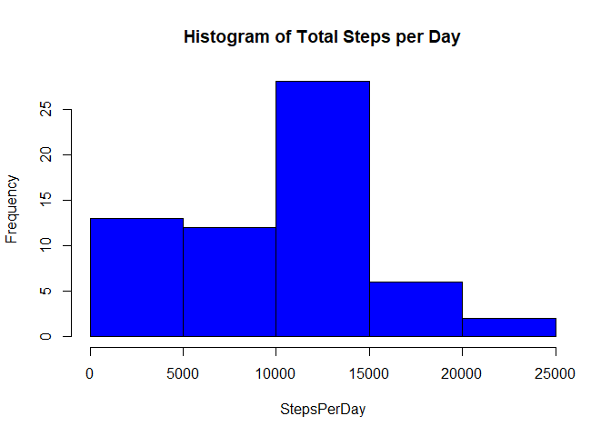
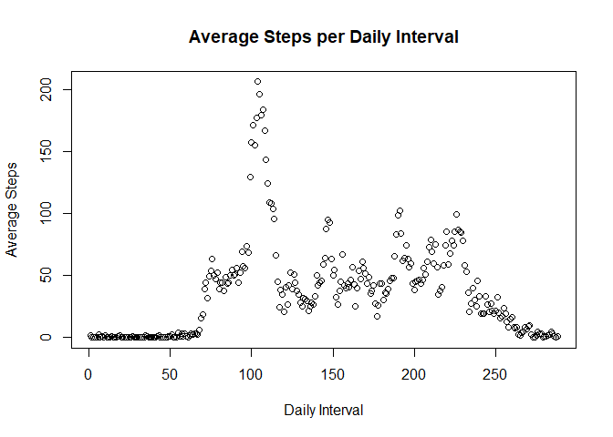
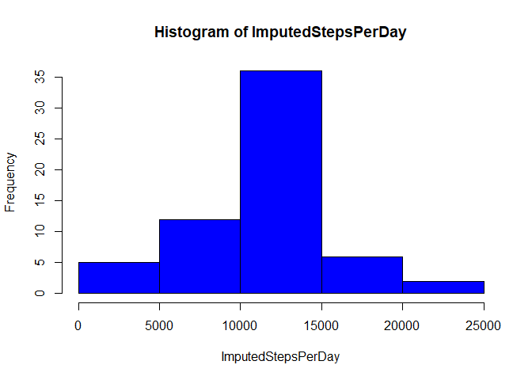
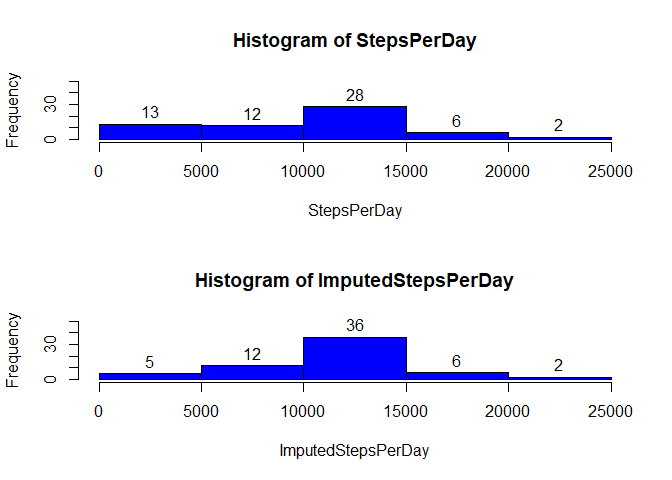
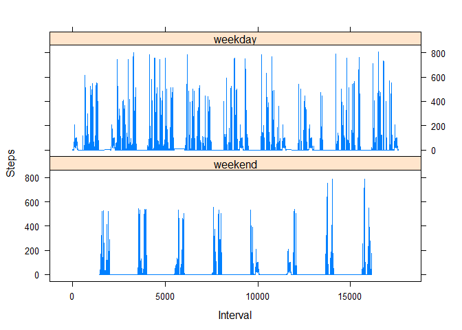

## Introduction  

(Verbatim from the Assignment) It is now possible to collect a large amount of data about personal movement using activity monitoring devices such as a Fitbit, Nike Fuelband, or Jawbone Up. These type of devices are part of the “quantified self” movement – a group of enthusiasts who take measurements about themselves regularly to improve their health, to find patterns in their behavior, or because they are tech geeks. But these data remain under-utilized both because the raw data are hard to obtain and there is a lack of statistical methods and software for processing and interpreting the data.

This assignment makes use of data from a personal activity monitoring device. This device collects data at 5 minute intervals through out the day. The data consists of two months of data from an anonymous individual collected during the months of October and November, 2012 and include the number of steps taken in 5 minute intervals each day.

The data for this assignment can be downloaded from the course web site:

Dataset: Activity monitoring data [52K] https://d396qusza40orc.cloudfront.net/repdata%2Fdata%2Factivity.zip 

The variables included in this dataset are:  
**steps:** Number of steps taking in a 5-minute interval (missing values are coded as <span style="color:red">NA</span>)  
**date:** The date on which the measurement was taken in YYYY-MM-DD format  
**interval:** Identifier for the 5-minute interval in which measurement was taken  

The dataset is stored in a comma-separated-value (CSV) file and there are a total of 17,568 observations in this dataset.

## Loading and preprocessing the data  

Loading and preprocessing the data begins with setting the working directory and creating a data directory there, then downloading the data, unzipping it and recording the download date.


```r
setwd("C:\\Users\\Kathy\\Desktop\\RRR\\datasciencecoursera\\Course5Week2Project1") ## Set working directory

if (!file.exists("data")) {
        dir.create("data")
}  ## Create directory of data if it does ot exist

temp <- tempfile()
fileURL <- "https://raw.githubusercontent.com/KathrynAlexander/RepData_PeerAssessment1/master/activity.zip"
download.file(fileURL,destfile = "./data/temp")

activity <- read.table(unz("./data/temp", "activity.csv"),header = TRUE, sep = ",")
unlink(temp)

date()  ## date Downloaded
```

```
## [1] "Mon Jul 29 20:16:55 2019"
```

A quick look at the structure of the data shows that the dates need to be converted to date format and steps need to be converted to numeric format in preparation for further analysis.  


```r
str(activity)
```

```
## 'data.frame':	17568 obs. of  3 variables:
##  $ steps   : int  NA NA NA NA NA NA NA NA NA NA ...
##  $ date    : Factor w/ 61 levels "2012-10-01","2012-10-02",..: 1 1 1 1 1 1 1 1 1 1 ...
##  $ interval: int  0 5 10 15 20 25 30 35 40 45 ...
```

```r
activity$date <- as.Date(activity$date, format="%Y-%m-%d") ## Put date in date format
activity$steps <- as.numeric(as.character(activity$steps))  ## Put steps in numeric format
```

## What is the mean total number of steps taken per day?  

The dplyr package is loaded, and several masked objects are noted.  These are not used in the current analysis, so this is informational only.


```r
library(dplyr)
```

```
## 
## Attaching package: 'dplyr'
```

```
## The following objects are masked from 'package:stats':
## 
##     filter, lag
```

```
## The following objects are masked from 'package:base':
## 
##     intersect, setdiff, setequal, union
```

The data is grouped by date and the steps are summed for each date to calculate the total number of steps taken per day.


```r
activity1 <- activity %>%
        group_by(date) %>%
        summarise(
        steps = sum(steps, na.rm = TRUE))
activity1
```

```
## # A tibble: 61 x 2
##    date       steps
##    <date>     <dbl>
##  1 2012-10-01     0
##  2 2012-10-02   126
##  3 2012-10-03 11352
##  4 2012-10-04 12116
##  5 2012-10-05 13294
##  6 2012-10-06 15420
##  7 2012-10-07 11015
##  8 2012-10-08     0
##  9 2012-10-09 12811
## 10 2012-10-10  9900
## # ... with 51 more rows
```

For visualization, a histogram is created to show the total number of steps taken per day.  

```r
StepsPerDay <- activity1$steps
hist(StepsPerDay,main="Histogram of Total Steps per Day", col="blue")
```

<!-- -->

The mean and median number of steps per day are calculated.  

```r
mean(activity1$steps)
```

```
## [1] 9354.23
```

```r
median(activity1$steps)
```

```
## [1] 10395
```

## What is the average daily activity pattern?  

A time series plot of the 288 5-minute intervals each day, and the average number of steps taken in each interval, averaged across all days, is created to visualize the data.  


```r
activity$intervalnumber <- c(1:288)  ## Assign an interval number identifying the same interval for each day 
activity3 <- aggregate(activity$steps, list(activity$intervalnumber), mean, na.rm = TRUE)
plot(activity3,  main="Average Steps per Daily Interval",
     ylab="Average Steps", xlab="Daily Interval")
```

<!-- -->

The 5-minute interval, that on average contains the maximum number of steps is calculated.  Interval 104 contains the maximum number of steps, which is 206.1698  


```r
activity3max <- activity3 %>% filter(x==max(x))  ## Get max
activity3max  
```

```
##   Group.1        x
## 1     104 206.1698
```

## Imputing missing values 

As there are a number of missing values in the data (which are coded as NA's), bias could be introduced.  

To explore this potential issue, the first step is to calculate the number of records with missing values. 


```r
activity4 <- sapply(X = activity, FUN = function(x) sum(is.na(x)))  ## Calculate total NA's
activity4
```

```
##          steps           date       interval intervalnumber 
##           2304              0              0              0
```

The next step is to devise a strategy for imputing (filling in) the missing values in the dataset.  The devised strategy is to use the average number of steps per interval across all days, for theinterval with the missing value.  A column with the average steps per interval across days is added to the data set.  Next a new dataset is created and the coalesce function is used to replace NA's with the average steps across all days for the interval of interest.

```r
activity$intervalavgsteps <- activity3$x  ## Add a column of the average steps per interval across days

activity5 <- activity %>%  ## new data set
        mutate(imputedsteps = coalesce(steps, intervalavgsteps)) ## Replace NA's with average steps per interval across all days 
```

To visualize the data, a histogram of the total number of steps taken each day (with imputed data) is created.

```r
activity6 <- activity5 %>%
        group_by(date) %>%
        summarise(
                imputedsteps = sum(imputedsteps))   ## Summarize imputed steps per day
ImputedStepsPerDay <- activity6$imputedsteps
hist(ImputedStepsPerDay,col="blue")
```

<!-- -->

For further visualization, the original data is compared with data including imputed values, via histograms in a panel plot format.

```r
par(mfcol = c(2,1))  ## Set Structure of Plots

StepsPerDay <- activity1$steps
h <- hist(StepsPerDay,ylim=c(0, 50), col="blue")
text(h$mids,h$counts,labels=h$counts, adj=c(0.5, -0.5))  ## Plot original date

ImputedStepsPerDay <- activity6$imputedsteps
h <- hist(ImputedStepsPerDay,ylim=c(0, 50),col="blue")
text(h$mids,h$counts,labels=h$counts, adj=c(0.5, -0.5))  ## Plot data including imputed data
```

<!-- -->

Finally, the mean and median of the data including the imputed steps is calculated. 


```r
mean(activity6$imputedsteps)
```

```
## [1] 10766.19
```

```r
median(activity6$imputedsteps)
```

```
## [1] 10766.19
```

In comparison, the mean and median with imputed data are both higher than the mean (9354.23) and median (10395) from the original data.  Also, as shown by the histogram, some of the data that was in in the 0 to 5000 step division in the original data now appears in the 10,000 to 15,000 step division when NA data is imputed.  Therefore, imputing the data does somewhat skew the statistics of the dataset.

## Are there differences in activity patterns between weekdays and weekends?  

The day of the week is determined for the data using the weekday() function, then it is further categorized to be a weekday or weekend day using the isWeekday() function from the timeDate library. A factor column with the levels of weekend and weekday is added to the dataset to store this information.   

```r
activity5$day <-weekdays(activity5$date)  ## Determine day of week
library(timeDate)
activity5$dayboolean <- isWeekday(activity5$date, wday=1:5)  ## Determine weekday or weekend as Boolean
activity5$dayfactor <- factor(activity5$dayboolean, labels=c("weekend", "weekday"))  # create factor
str(activity5)
```

```
## 'data.frame':	17568 obs. of  9 variables:
##  $ steps           : num  NA NA NA NA NA NA NA NA NA NA ...
##  $ date            : Date, format: "2012-10-01" "2012-10-01" ...
##  $ interval        : int  0 5 10 15 20 25 30 35 40 45 ...
##  $ intervalnumber  : int  1 2 3 4 5 6 7 8 9 10 ...
##  $ intervalavgsteps: num  1.717 0.3396 0.1321 0.1509 0.0755 ...
##  $ imputedsteps    : num  1.717 0.3396 0.1321 0.1509 0.0755 ...
##  $ day             : chr  "Monday" "Monday" "Monday" "Monday" ...
##  $ dayboolean      : logi  TRUE TRUE TRUE TRUE TRUE TRUE ...
##  $ dayfactor       : Factor w/ 2 levels "weekend","weekday": 2 2 2 2 2 2 2 2 2 2 ...
```

To prepare for a panel plot, each data record must have a sequential Interval number, and so this is created using the dplyr mutate function and row numbers.

```r
activity5 <- activity5 %>% mutate(Interval = row_number())
```

Weekday and weekend plots are created to compare the average number of steps taken per 5-minute interval across weekdays and weekends.  The lattice plot system is used.  By visual inspection of the plot, it appears that there is less activity on the weekends than on the weekdays.

```r
library("lattice")
Interval <- activity5$Interval
Steps <- activity5$imputedsteps
xyplot(Steps ~ Interval | factor(dayfactor), data=activity5, type = "l",layout=c(1,2))
```

<!-- -->


